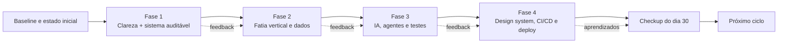
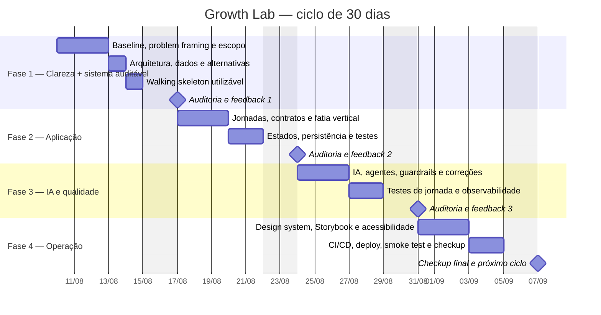

# Painel de acompanhamento — fases complementares

Autor: Bruno Liberato Girardi

Este é o artefato visual do avaliador. As fases são cumulativas: cada uma parte da evidência, das decisões e do feedback da anterior. A nota semanal é um snapshot; a evolução real aparece na comparação com o baseline.

## Visão do ciclo

Não é necessário que o executor termine uma fase perfeitamente antes de iniciar a próxima. É necessário que ele registre o que aprendeu, corrija a rota e carregue as decisões importantes para a fase seguinte.

## Gantt de referência

Substitua `2026-08-10` pela data real de início do ciclo antes de compartilhar ou acompanhar. O desenho considera quatro semanas e um checkup final.

## Quatro trilhas que evoluem juntas

| Trilha | Fase 1 | Fase 2 | Fase 3 | Fase 4 |
|---|---|---|---|---|
| Produto | Problema, escopo e sistema mínimo auditável | Jornada, dados e próxima ação | Feedback e recuperação | Checkup e próximo ciclo |
| Técnica | Fronteiras e dados | Contratos e persistência | Agentes, testes e observabilidade | CI/CD, deploy e operação |
| Aprendizagem | Estudar e explicar conceitos | Aplicar em demanda real | Corrigir com IA e verificar | Ensinar, comparar e consolidar |
| Comportamento | Clareza e ownership | Disciplina e comunicação | Resposta a feedback | Autonomia e honestidade operacional |
| Evidência | Baseline e decisões | Código e testes | Logs, correções e jornadas | URL, pipeline e comparação final |

## O que você deve conseguir ver visualmente

O sistema construído deve apresentar, sem depender de uma planilha externa:

- fase atual e dias restantes;
- objetivo âncora;
- próxima ação;
- conteúdo em estudo e prática associada;
- evidências da semana;
- feedback e ação derivada;
- nota por critério ao longo do tempo;
- baseline versus estado atual;
- bloqueios abertos e resolvidos;
- histórico de decisões e usos de IA.

Isso define o que precisa ser observável no produto, mas não dita o layout. O executor ainda deve decidir a melhor experiência.

## Regra de progressão

Uma fase não avança porque o calendário mudou. Ela avança quando existe uma evidência mínima:

- Fase 1: problema, recorte, baseline, arquitetura e walking skeleton utilizável;
- Fase 2: fluxo pequeno funcionando com dados, estados e testes;
- Fase 3: uso crítico de IA, correção e testes de jornada;
- Fase 4: qualidade, publicação, operação e comparação final.

Se uma fase ficar bloqueada, o bloqueio vira parte explícita do painel e gera uma próxima ação. Não se deve esconder o atraso nem marcar a etapa como concluída por conveniência.

## Gate da Fase 1

Sem o sistema mínimo auditável, a Fase 1 não está concluída. Documentos de arquitetura e telas estáticas podem receber feedback, mas não substituem o fluxo executável de ciclo, baseline, evidência, check-in, nota e feedback.
