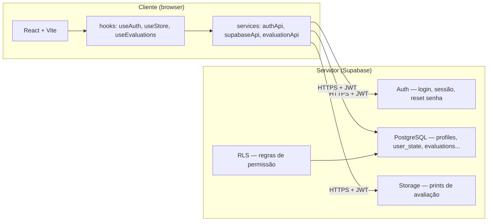
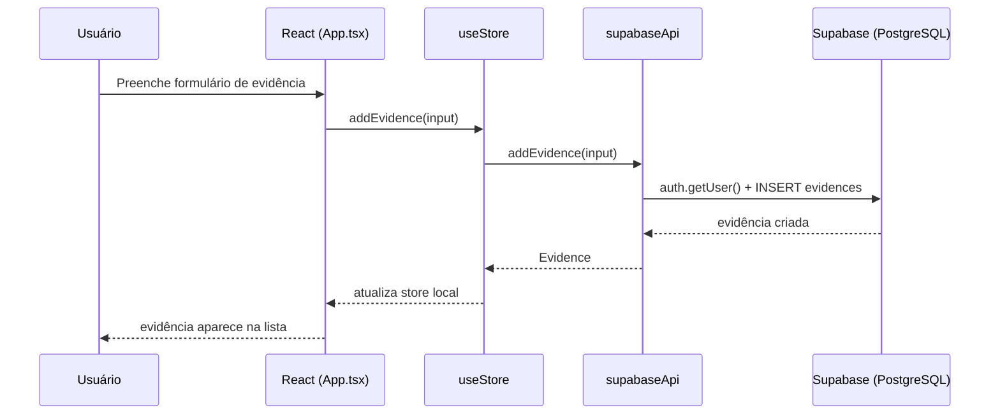
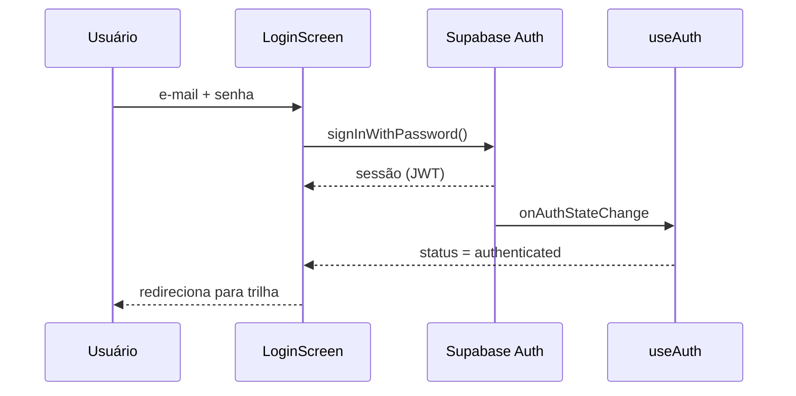

# Arquitetura cliente-servidor no Growth Lab

Documento de referência sobre como o Growth Lab separa **cliente** (browser) e **servidor** (Supabase), com exemplos reais do código.

**Última atualização:** agosto/2026  
**App em produção:** https://app-zeta-tan-38.vercel.app

---

## Resumo

Sim — o Growth Lab usa arquitetura **cliente-servidor**. O detalhe importante é que o “servidor” de produção **não** é um Express rodando na Vercel: é o **Supabase** (Backend-as-a-Service). Ainda existe um servidor Express legado no repositório, usado no protótipo inicial (`projeto-base`).

| Camada | Onde fica | Papel |
|--------|-----------|-------|
| **Cliente** | `app/src/` (React no browser) | UI, estado local, chamadas à API |
| **Servidor** | Supabase (nuvem) | Auth, banco PostgreSQL, arquivos, regras de segurança (RLS) |

---

## Diagrama geral



### Fluxo típico de uma requisição

1. Usuário interage com a UI (React).
2. Um hook dispara uma função de serviço (`*Api.ts`).
3. O serviço chama o Supabase via HTTPS, enviando o JWT da sessão.
4. Supabase valida auth + RLS, executa query/upload.
5. Resposta volta ao hook → estado React atualiza → UI re-renderiza.

---

## Onde está cada peça no código

| Responsabilidade | Arquivo(s) |
|------------------|------------|
| Cliente Supabase (config) | `app/src/lib/supabase.ts` |
| Autenticação | `app/src/services/authApi.ts`, `app/src/hooks/useAuth.ts` |
| Estado da trilha (progresso, quizzes, evidências) | `app/src/services/supabaseApi.ts`, `app/src/hooks/useStore.ts` |
| Avaliações semanal e final | `app/src/services/evaluationApi.ts`, `app/src/hooks/useEvaluations.ts` |
| Backoffice (admin) | `app/src/services/backofficeApi.ts`, `app/src/hooks/useBackOffice.ts` |
| Upload de prints | `app/src/services/evaluationAttachmentApi.ts` |
| Servidor legado (protótipo) | `app/server/index.ts`, `app/src/services/api.ts` |

---

## Exemplos concretos

### 1. Login — cliente pede, servidor autentica

**Cliente** — `app/src/components/auth/LoginScreen.tsx`:

```typescript
const { error } = await supabase.auth.signInWithPassword({
  email: values.email.trim(),
  password: values.password,
})
```

**Servidor (Supabase Auth):** valida e-mail e senha, devolve JWT/sessão.

**Hook que escuta a sessão** — `app/src/hooks/useAuth.ts`:

```typescript
supabase.auth.getSession().then(({ data }) => {
  applyAuthState('INIT', data.session)
})

const { data: { subscription } } = supabase.auth.onAuthStateChange((event, newSession) => {
  applyAuthState(event, newSession)
})
```

**Fluxo:** browser → Supabase Auth → sessão armazenada no cliente → UI muda para área logada.

---

### 2. Progresso da trilha — ler e gravar estado

**Cliente** — `app/src/hooks/useStore.ts` usa `supabaseApi`:

```typescript
import { supabaseApi as api } from '../services/supabaseApi'

api.getState(userId)   // carregar progresso
api.saveState(store)   // persistir ao marcar conteúdo ou quiz
```

**Serviço** — `app/src/services/supabaseApi.ts`:

```typescript
// GET — buscar progresso do participante
const { data, error } = await supabase
  .from('user_state')
  .select('completed, scores, quizzes, theme')
  .eq('user_id', targetUserId)
  .maybeSingle()

// PUT — salvar quando marca conteúdo concluído ou responde quiz
const { error } = await supabase
  .from('user_state')
  .upsert(
    { user_id: user.id, completed, quizzes, theme, updated_at: ... },
    { onConflict: 'user_id' },
  )
```

**Servidor:** PostgreSQL, tabela `user_state`. Evidências ficam em tabela separada `evidences`.

**Fluxo:** usuário clica “concluído” → hook atualiza estado local → `saveState` → Supabase persiste → na próxima visita `getState` restaura tudo.

---

### 3. Avaliações semanal e final

**Cliente** — `app/src/hooks/useEvaluations.ts`:

```typescript
await evaluationApi.saveWeekEvaluation({ learnerId, week, overall, notes, attachments })
await evaluationApi.saveFinalEvaluation({ learnerId, scores, notes, attachments })
```

**Serviço** — `app/src/services/evaluationApi.ts`:

```typescript
const { data: { user } } = await supabase.auth.getUser()
// ...
await supabase.from('evaluations').upsert({
  learner_id: learnerId,
  evaluator_id: user.id,
  scope: 'week' | 'final',
  week,
  scores,
  notes,
  attachments,
})
```

**Servidor:** tabela `evaluations`. Admin grava; participante lê (regras RLS no Supabase).

---

### 4. Upload de prints de avaliação

**Cliente** — `app/src/services/evaluationAttachmentApi.ts`:

```typescript
const { error } = await supabase.storage
  .from('evaluation-prints')
  .upload(path, file, { contentType: file.type })

const { data } = supabase.storage.from(BUCKET).getPublicUrl(path)
return createAttachment(data.publicUrl, file.name)
```

**Servidor:** Supabase Storage guarda o arquivo; o cliente recebe URL pública para exibir na UI.

---

### 5. Recuperação de senha

**Cliente** — `app/src/services/authApi.ts`:

```typescript
await supabase.auth.resetPasswordForEmail(email.trim(), {
  redirectTo: getAuthRedirectUrl(),
})

await supabase.auth.updateUser({ password })
```

**Servidor:** Supabase envia e-mail, valida link de recovery e atualiza a senha. O cliente só exibe formulários e timer de reenvio (UX local).

---

### 6. Backoffice (visão admin)

**Cliente** — `app/src/services/backofficeApi.ts`:

```typescript
supabase.from('profiles').select('user_id, email, role, active')
supabase.from('user_state').select('user_id, completed, quizzes, updated_at')
supabase.from('evidences').select('user_id')
supabase.from('evaluations').select('learner_id, scope, week')
```

**Servidor:** várias queries agregadas no cliente para montar estatísticas. Só funciona se o perfil tiver `role: 'admin'` (RLS + checagem de role).

---

## O que fica no cliente vs no servidor

| No cliente (browser) | No servidor (Supabase) |
|----------------------|-------------------------|
| Renderizar telas e componentes | Validar login e sessão (JWT) |
| Estado React (formulários, timers, dirty flags) | Persistir dados no PostgreSQL |
| Regras de UX (ex.: cooldown 60s antes de reenviar link) | RLS — quem pode ler/escrever cada tabela |
| Cálculos de exibição (média das notas na UI) | Storage de arquivos (prints) |
| Validação básica de formulário | Autorização por perfil (admin vs learner) |

---

## Modelo legado ainda no repositório (protótipo)

Antes do Supabase, o `projeto-base` usava **React + Express + arquivo JSON**.

**Servidor Express** — `app/server/index.ts`:

```typescript
app.get('/api/health', ...)
app.get('/api/state', ...)
app.put('/api/state', ...)
app.post('/api/evidences', ...)
app.delete('/api/evidences/:id', ...)
```

**Cliente legado** — `app/src/services/api.ts`:

```typescript
async function request<T>(url: string, init?: RequestInit): Promise<T> {
  const response = await fetch(url, { ... })
  return response.json()
}

export const api = {
  getState: () => request<AppStore>('/api/state'),
  saveState: (store) => request('/api/state', { method: 'PUT', body: JSON.stringify(store) }),
  // ...
}
```

Esse é o modelo clássico **SPA + API REST + persistência local**. Hoje, em produção, o app usa **`supabaseApi`**, não `api.ts`. O Express ficou como referência histórica e para estudos locais.

### Comparação dos dois modelos

| Aspecto | Protótipo (Express) | Produção (Supabase) |
|---------|---------------------|---------------------|
| Servidor | Node/Express na porta 3001 | Supabase (managed) |
| Persistência | `server/data/store.json` | PostgreSQL |
| Auth | Não tinha (ou mock) | Supabase Auth |
| Arquivos | Não tinha | Supabase Storage |
| Deploy | Local | Vercel (cliente) + Supabase (servidor) |
| Cliente chama | `fetch('/api/...')` | `supabase.from(...)` / `supabase.auth.*` |

---

## Configuração cliente → servidor

O cliente se conecta ao Supabase via variáveis de ambiente (Vercel):

- `VITE_SUPABASE_URL`
- `VITE_SUPABASE_ANON_KEY`

Definidas em `app/src/lib/supabase.ts`:

```typescript
export const supabase = createClient(SUPABASE_URL!, SUPABASE_ANON_KEY!)
```

A chave `anon` é pública (vai no bundle do browser). A segurança real vem do **JWT do usuário logado** + **RLS** no banco — nunca expor `service_role` no frontend.

---

## Diagrama de sequência — salvar evidência



---

## Diagrama de sequência — login



---

## Perguntas para fixar o estudo

1. O que acontece se o Supabase estiver fora do ar? Onde a falha aparece na UI?
2. Por que `VITE_SUPABASE_ANON_KEY` pode ir no frontend, mas `service_role` não?
3. Qual a diferença entre `api.ts` e `supabaseApi.ts`? Qual está em uso hoje?
4. Quem decide se um participante pode editar a avaliação final — o React ou o Supabase?
5. Desenhe o caminho completo: admin salva nota da semana 2 → participante vê o feedback.

---

## Links relacionados na trilha de estudos

- [01 — limites de arquitetura](../01-limites-de-arquitetura.md)
- [02 — BFF e contratos](../02-bff-e-contratos.md)
- [03 — dados e persistência](../03-dados-e-persistencia.md)
- [08 — CI/CD, deploy e operação](../08-cicd-deploy-e-operacao.md)

## Referências externas

- [Client-server overview — MDN](https://developer.mozilla.org/en-US/docs/Learn_web_development/Extensions/Server-side/First_steps/Client-Server_overview)
- [Supabase — Architecture](https://supabase.com/docs/guides/getting-started/architecture)
- [Supabase — Row Level Security](https://supabase.com/docs/guides/database/postgres/row-level-security)
